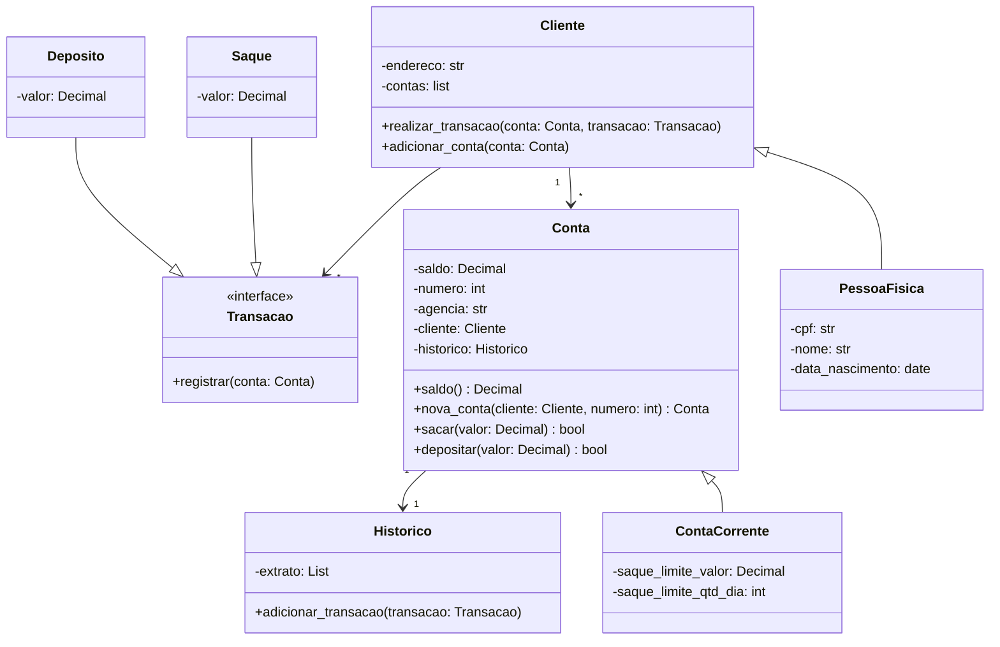

# (DIO) Projeto criando sistema bancario em python

Sistema bancario simples que permite depositar (valor positivo), sacar e imprimir um extrato.
Nessa v1 não será necessário considerar controle de acesso e multiplos usuarios, e moeda única R$.

## Requisitos

- [x] Depositar valor positivo
- [x] Fazer saques de ate R$ 500,00
- [x] Limite de 3 saques por dia
- [x] Caso usuario não tenha saldo, exibir mensagem de falta de saldo
- [x] Imprimir extrato
- [x] Modularizar projeto
  - [x] Função saque deve receber os argumentos apenas por nome (keyword only)
    - Sugestão de entrada: saldo, valor, extrato, limite, numero_saques, limite_saques
    - Sugestão de retorno: saldo e extrato
  - [x] Função deposito deve receber os argumentos apenas por posição (positional only)
    - Sugestão de entrada: saldo, valor, extrato
    - Sugestão de saida: saldo e extrato
  - [x] Função extrato deve receber os argumentos por posição e nome (positional only e keyword only)
    - Sugestão de entrada: saldo (positional) e extrato (nomeado)
- [x] Adicionar usuario, podendo ter 1 por cpf
  - [x] Usuário composto por nome, data de nascimento, cpf e endereço (string com formato "logradouro, nro - bairro - cidade/sigla estado")
  - [ ] Implementar validações
  - [x] Armazenar somente numeros no cpf
- [x] Adicionar conta, precisando estar vinculado a um usuario (1 usuario podem ter varias contas)
  - [x] Conta composto por: agencia, numero da conta e usuario.
  - [x] Numero da conta é sequencial, iniciando em 1
  - [x] Numero da agencia é fixo "0001"
- [ ] Para acessar as funcionalidades de deposito, saque e extrato, deve passar que agencia e conta
  - [ ] Para isso primeiro selecionar qual usuario, listas as contas e assim selecionar agencia e conta
- [x] Organizar código conforme [Modelagem UML](#modelagem-uml)
- [x] Adequar funcionamento do projeto conforme alteração de modelagem
- [x] Decorador de Log
  - Implementar um decorador que seja aplicado a todas as funções (adicionar cliente, adicionar conta, depósito, saque). Esse decorador deve registrar data e hora de cada transação e a descrição da transação.
- [x] Gerador de relatório
  - Criar gerador que permita iterar sobre o extrato de uma conta, e retornar, uma a uma, as transações realizadas. Também deve possiblitar filtrar as transação com base no tipo (saque ou deposito).
- [x] Iterador personalizado
  - Implementar iterador personalizado ContaIterador que permita iterar sobre todas as contas do banco, retornando informações básicas de cada conta(cliente, número da conta e saldo atual)
- [x] Limitar a 10 transacoes por dia

## Modelagem UML



## Como usar

Pode executar via terminal

```bash
python -m sistema_bancario
```

ou via Makefile, podendo configurar variaveis de ambiente copiando `.env.example` para `.env`:

```bash
make run
```
